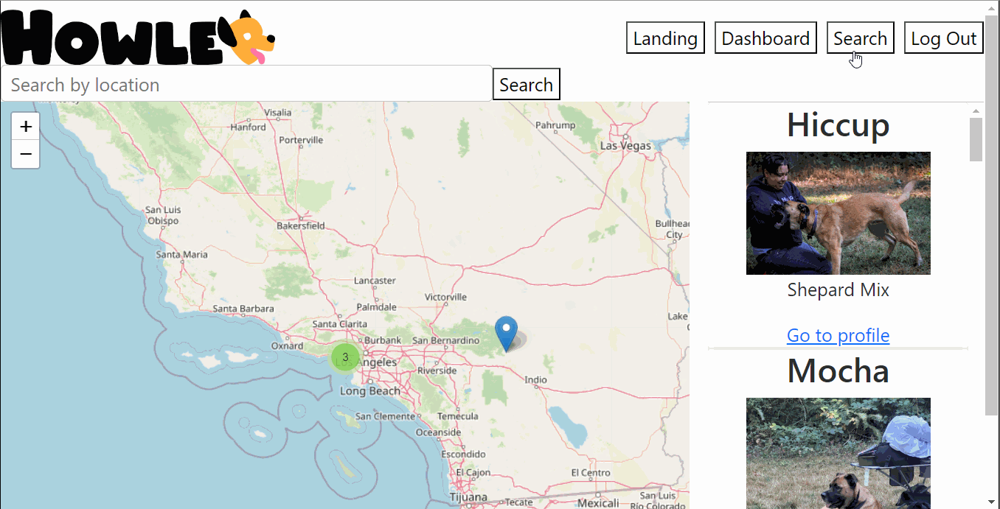

# dog-friends

## Table of Contents

* [Description](#description)
* [Technologies Used](#technologies-used)
* [User Stories](#user-stories)
* [Installation](#installation)
* [Usage](#usage)
* [Models and Routes](#models-and-routes)
* [New libraries/NPM Packages](#new-libraries/npm-packages)
* [Credits](#credits)
* [License](#license)

## Description 

# Goals
The purpose of this project is to provide dog owners, who want to find playmates for their pet, a convenient way to connect with likeminded owners in their area. Users will be able to search for other users by location and filter other users to find playmates who meet their dogs specific needs. For example, Users who own smaller dogs may filter out larger dog Users. Ideally a user will be able to find local dogs who fit their pets playstyle needs and then be able to connect with them. 

# First Iteration

Try it here: [Howler](https://howler.herokuapp.com/)

## Technologies Used

- 
- 
- 
- 
- 
- 
- 
- 
- 
- 
- 
- 
- 
- 
- 
- 
- 
- 
- 
- 
- 
- 
- 
- 
- 
- 

## User Stories 

- As a user I want to be able to search by playstyles so that I can find dogs with similar interests
- As a user I want to be able to view other dogs profiles so that I can preview information and check if we match
- As a user I want to be able to create a profile and add a subprofile for each of my dogs || So that my each dogs can have different playmates
- As a user I want to be able view a map of my area and search for other dogs (with filters) || So that I can see which playmates are available around me
- As a user I want to be able to DM other pet parents || So that we can arrange playdates
- As a user I want to be able to create a public event || So that I can arrange a bday party for my dog at my local dog park (stretch)
- As a user I want to be able to search local public events (stretch) 
- As a user I want to be able to leave an endorsement for dogs that we had play dates with
(all the play styles can get dog bone) 

### Search for Dogs
To search for other dogs on Howler, click on the "Search" button in the navigation bar. You can search different locations for dogs. Once you find a dog you are interested in, you can view their profile and send a message to their owner to connect and arrange a playdate.

### Viewing a dog profile
To view a dog's profile, simply click on the 'View Profile' from the search results. The dog's profile will display their name, breed, age, bio, and playstyle, as well as any photos that have been uploaded by the owner.

That's it! With these basic features, you should be able to use the Howler app to find other dog owners and connect with their dogs for fun and friendship.

## Models and Routes

Below is an ERD of our database schema and table relationships. We used MongoDB and Mongoose to create our database.

Below is a list of our API routes and their corresponding controller methods.
<!-- 
| Route | HTTP Verb | Description |
| ----- | --------- | ----------- |
| `/api/users` | `GET` | Get all users |
| `/api/users` | `POST` | Create a new user |
| `/api/users/:id` | `GET` | Get a user by id |
| `/api/users/:id` | `PUT` | Update a user by id |
| `/api/pins` | `GET` | Get all pins |
| `/api/pins` | `POST` | Create a new pin |
| `/api/pins/:id` | `GET` | Get a pin by id |
| `/api/pins/:id` | `PUT` | Update a pin by id |
| `/api/pins/:id` | `DELETE` | Delete a pin by id |
| `/api/trips` | `GET` | Get all trips |
| `/api/trips` | `POST` | Create a new trip |
| `/api/trips/:id` | `GET` | Get a trip by id |
| `/api/trips/:id` | `PUT` | Update a trip by id |
| `/api/trips/:id` | `DELETE` | Delete a trip by id |
| `/api/journals` | `GET` | Get all trip journals |
| `/api/journals` | `POST` | Create a new trip journal |
| `/api/journals/:id` | `GET` | Get a trip journal by id |
| `/api/journals/:id` | `PUT` | Update a trip journal by id |
| `/api/journals/:id` | `DELETE` | Delete a trip journal by id | -->

## Learning Objectives

## Credits

### Authors and Contact Information

1. Becka McNally:
  * [Github](https://github.com/beckamcnally/beckamcnally)
  * [LinkedIn](https://www.linkedin.com/in/becka-mcnally/)
2. Brett Santor:
  * [Github](https://github.com/BrettSantor) 
  * [LinkedIn](https://www.linkedin.com/in/brettsantor/)
3. Daniele Bensan:
  * [Github](https://github.com/DBBENSAN)
  * [LinkedIn](https://www.linkedin.com/in/danielebensan/)
4. Travis DuPree:
  * [Github](https://github.com/Traveye)
  * [LinkedIn](https://www.linkedin.com/in/travis-dupree-96380218b/)

### Dependencies
- [`@apollo/client`](https://www.apollographql.com/docs/react/) (^3.5.8)
- [`@testing-library/jest-dom`](https://testing-library.com/docs/dom-testing-library/intro/) (^5.16.5)
- [`@testing-library/react`](https://testing-library.com/docs/react-testing-library/intro/) (^13.4.0)
- [`@testing-library/user-event`](https://testing-library.com/docs/ecosystem-user-event/) (^13.5.0)
- [`Bootstrap`](https://getbootstrap.com/) (^5.2.3)
- [`GraphQL`](https://graphql.org/) (^15.5.0)
- [`jwt-decode`](https://github.com/auth0/jwt-decode) (^3.1.2)
- [`Leaflet`](https://leafletjs.com/) (^1.9.3)
- [`leaflet-control-geocoder`](https://github.com/perliedman/leaflet-control-geocoder) (^2.4.0)
- [`React`](https://reactjs.org/) (^18.2.0)
- [`React DOM`](https://reactjs.org/docs/react-dom.html) (^18.2.0)
- [`React-Leaflet`](https://react-leaflet.js.org/) (^4.2.1)
- [`react-leaflet-cluster`](https://github.com/YUzhva/react-leaflet-cluster) (^2.1.0)
- [`React Router DOM`](https://reactrouter.com/web/guides/quick-start) (^6.2.1)
- [`react-scripts`](https://create-react-app.dev/docs/available-scripts/) (5.0.1)
- [`SweetAlert`](https://sweetalert.js.org/) (^2.1.2)
- [`web-vitals`](https://web.dev/vitals/) (^2.1.4)

### Special Thanks
Special thanks to James Harding, Manuel Nunes, and Jerome Chennete for their valuable feedback.

