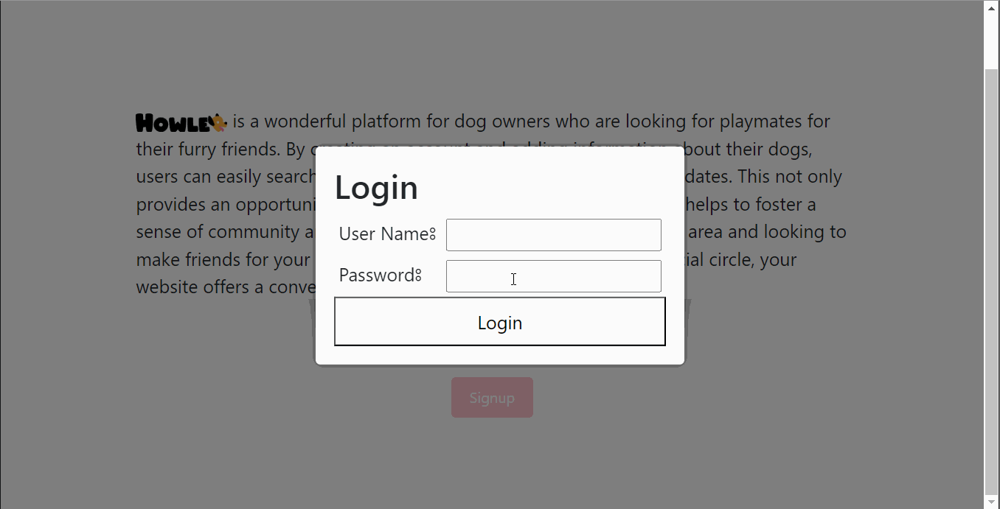
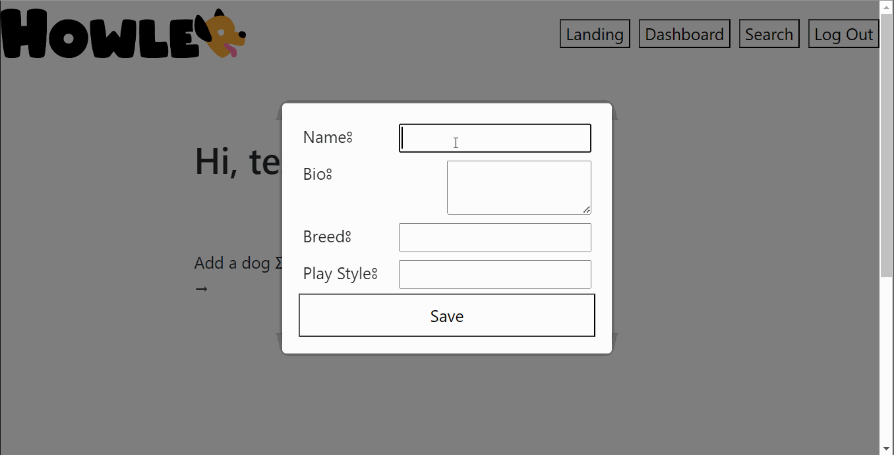

# dog-friends

## Table of Contents

* [Description](#description)
* [Technologies Used](#technologies-used)
* [User Stories](#user-stories)
* [Installation](#installation)
* [Usage](#usage)
* [Models and Routes](#models-and-routes)
* [New libraries/NPM Packages](#new-libraries/npm-packages)
* [Credits](#credits)
* [License](#license)

## Description 

Try it here: 

## Technologies Used

## Usage 

### Login/SignUp

To use the Howler app, you must first create an account. Click on the "Sign Up" button on the landing page and enter your details to create an account. If you already have an account, click on the "Login" button and enter your credentials to access your account.

### Add Dog
Once you have logged in, you can add a dog to your profile by clicking on the "Add Dog" button. Enter your dog's details, such as name, breed, age, and any other information you want to include.

### Upload Media
You can add photos of your dog by clicking on the "Upload Media" button on your dog's profile page. You can upload multiple photos, and they will be displayed on your dog's profile for other users to see.

### Search for Dogs
To search for other dogs on Howler, click on the "Search" button in the navigation bar. You can search for dogs based on their breed, age, location, and other criteria. Once you find a dog you are interested in, you can view their profile and send a message to their owner to connect and arrange a playdate.

### Viewing a dog profile
To view a dog's profile, simply click on the 'View Profile' from the search results. The dog's profile will display their name, breed, age, bio, and playstyle, as well as any photos that have been uploaded by the owner.

That's it! With these basic features, you should be able to use the Howler app to find other dog owners and connect with their dogs for fun and friendship.

## Models and Routes

Below is an ERD of our database schema and table relationships. We used MongoDB and Mongoose to create our database.

Below is a list of our API routes and their corresponding controller methods.
<!-- 
| Route | HTTP Verb | Description |
| ----- | --------- | ----------- |
| `/api/users` | `GET` | Get all users |
| `/api/users` | `POST` | Create a new user |
| `/api/users/:id` | `GET` | Get a user by id |
| `/api/users/:id` | `PUT` | Update a user by id |
| `/api/pins` | `GET` | Get all pins |
| `/api/pins` | `POST` | Create a new pin |
| `/api/pins/:id` | `GET` | Get a pin by id |
| `/api/pins/:id` | `PUT` | Update a pin by id |
| `/api/pins/:id` | `DELETE` | Delete a pin by id |
| `/api/trips` | `GET` | Get all trips |
| `/api/trips` | `POST` | Create a new trip |
| `/api/trips/:id` | `GET` | Get a trip by id |
| `/api/trips/:id` | `PUT` | Update a trip by id |
| `/api/trips/:id` | `DELETE` | Delete a trip by id |
| `/api/journals` | `GET` | Get all trip journals |
| `/api/journals` | `POST` | Create a new trip journal |
| `/api/journals/:id` | `GET` | Get a trip journal by id |
| `/api/journals/:id` | `PUT` | Update a trip journal by id |
| `/api/journals/:id` | `DELETE` | Delete a trip journal by id | -->

## New libraries/NPM Packages

## Tailwinds CSS

## Different Page Sizes

## Learning Objectives

## Authors Contact Information

1. Becka McNally:
  * [Github](https://github.com/beckamcnally/beckamcnally)
  * [LinkedIn](https://www.linkedin.com/in/becka-mcnally/)
2. Brett Santor:
  * [Github](https://github.com/BrettSantor) 
  * [LinkedIn](https://www.linkedin.com/in/brettsantor/)
3. Daniele Bensan:
  * [Github](https://github.com/DBBENSAN)
  * [LinkedIn](https://www.linkedin.com/in/danielebensan/)
4. Travis DuPree:
  * [Github](https://github.com/Traveye)
  * [LinkedIn](https://www.linkedin.com/in/travis-dupree-96380218b/)

## Credits

